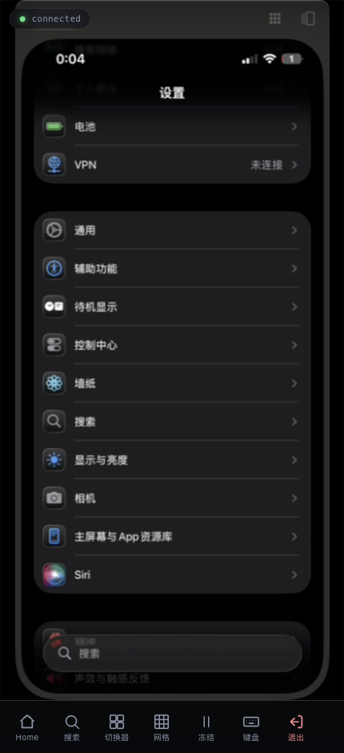
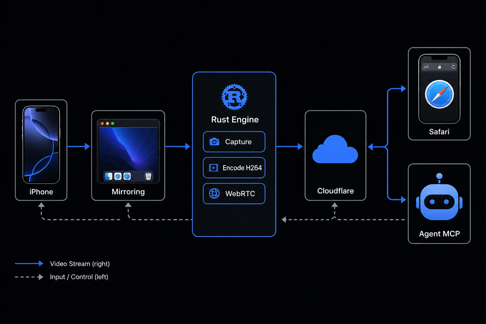
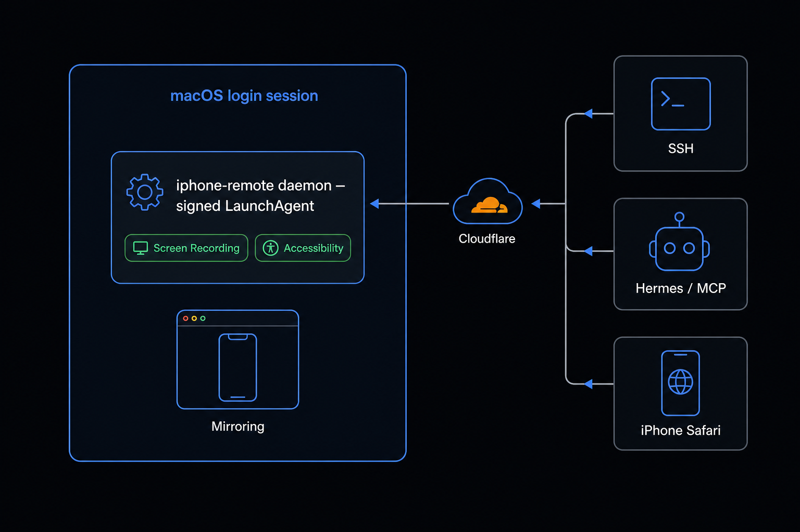
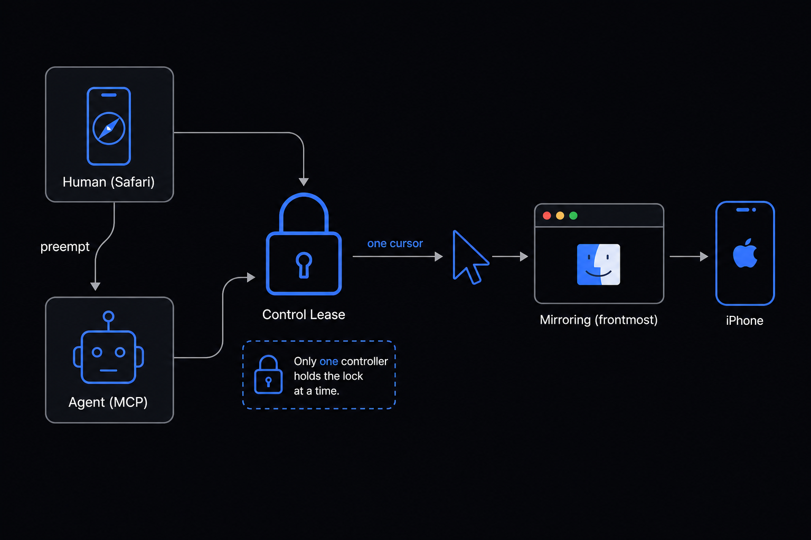

# iPhone Remote Panel

[](LICENSE)


<p align="center">
  
</p>

**Remote-control your iPhone from any web browser** — over macOS **iPhone Mirroring**,
with low-latency WebRTC video and near-native touch. A Rust daemon captures the Mirroring
window with **ScreenCaptureKit**, hardware-encodes it to **H.264** with **VideoToolbox**,
and streams it to iPhone Safari (or any browser) over **WebRTC** — injecting taps, swipes,
scrolls, and text back as continuous system events. AI agents, scripts, and bots can drive
the same phone through a simple **HTTP API**.

Think **Chrome Remote Desktop, but for your iPhone** — running entirely on your own Mac, no
third-party cloud.

## Features

- 📱 **Control an iPhone from a browser** — live screen with tap / swipe / scroll / type, on iPhone Safari or any desktop browser.
- ⚡ **Low latency** — hardware H.264 (VideoToolbox) over WebRTC, not screenshot polling.
- 🤚 **Near-native touch** — real scroll-wheel scrolling, keycode text input, Home / Spotlight / App-Switcher shortcuts.
- 🤖 **Agent-ready** — an HTTP API (`/agent/input`, `/agent/screenshot`) lets AI agents and scripts *see* and *drive* the phone.
- 🌐 **LAN or remote** — same Wi-Fi over your local network, or from anywhere via a Cloudflare tunnel + TURN.
- 🔒 **Self-hosted & authenticated** — password login; runs on your own machine, your screen never leaves your control.

> v2 — a full WebRTC + hardware-codec + continuous-input rebuild of the original
> v1 screenshot-polling server. The input + video vertical (video, tap, scroll,
> text, shortcuts, LAN WebRTC) is validated on real hardware.

## Architecture



A Rust daemon captures the macOS iPhone Mirroring window with **ScreenCaptureKit**,
hardware-encodes it to **H.264** with **VideoToolbox**, and streams it over **WebRTC**
(`webrtc-rs`, axum for HTTP/WS signaling). The same capture/input core serves two
front-ends: a **human client** (iPhone Safari — live video + continuous touch) and an
**agent client** (an HTTP control API; see [Agent API](#agent-api)). Touch is injected
back as continuous `CGEvent`s through the system HID event tap. STUN handles most NAT;
optional Cloudflare TURN relays the rest.

Key input findings baked into the daemon (all hardware-validated):

- **Scroll is a wheel event.** iPhone Mirroring reads a mouse-drag as a long-press /
  icon-reorder and never scrolls — a finger swipe must map to `CGEvent` scroll-wheel.
- **Text is keycodes, not Unicode.** Mirroring forwards virtual keycodes (and a *real*
  Shift key), not the `CGEvent` Unicode payload. **CJK caveat:** typing sends US keycodes;
  if the phone keyboard is a Chinese (Pinyin) IME, digits become candidate-selectors
  (`a1b2c3` → `啊不c3`) — switch the phone to the English ABC keyboard for literal text.
  Real CJK input needs the on-phone IME and is out of scope for now.
- **HID taps need the Mirroring window frontmost** — the daemon re-asserts focus only
  when another app steals it.

### Deployment — a GUI-session LaunchAgent



ScreenCaptureKit (Screen Recording) and input injection (Accessibility) require TCC
grants tied to a signed identity **in the login session** — an SSH-spawned binary is
denied. So the daemon runs as a codesigned **LaunchAgent** in the desktop session,
granted once; SSH shells, agents, and the iPhone Safari controller all **connect to it**.

### Control lease — one cursor, one controller



HID-tap input drives the host Mac's **one real cursor** with the Mirroring window
frontmost. A mandatory **control lease** grants that single cursor to one controller at a
time (human or agent); the most recent actor holds control. Without the lease, human and
agent would corrupt each other's gestures fighting over the same cursor. Viewers (WebRTC
video consumers not sending input) are unaffected: last-connected-wins for input, but all
viewers keep their video stream.

## Requirements

- macOS 15 Sequoia or later (iPhone Mirroring's requirement) with **iPhone
  Mirroring** set up and signed in. Validated on macOS 15 Sequoia / 26 Tahoe;
  see the [Roadmap](#roadmap) for macOS 27 support.
- Rust toolchain (to build) — `cargo`.
- **Zero external runtime dependencies** — all input (tap, scroll, text, key,
  shortcuts) is injected via native `CGEvent` directly, and screenshots use the
  built-in `screencapture` CLI. No third-party binary (`cua-driver` or otherwise)
  is required at runtime.
- *(optional)* a Cloudflare TURN key for cross-network (cellular / remote) access.

## Install

Build, bundle into a signed `.app`, and register the LaunchAgent:

```bash
cargo build --release --bin iphone-remote
./scripts/make-app.sh                 # → ./iPhoneRemote.app
./install.sh ./iPhoneRemote.app       # signs, installs, writes the LaunchAgent
```

`install.sh` binds `0.0.0.0`, generates a password (or uses `$PHONE_REMOTE_PASSWORD`),
opens the Screen Recording + Accessibility panes to grant once, and prints the iPhone
connect URL. On the iPhone (same Wi-Fi) open **`http://<mac-lan-ip>:8787/phone`** and
enter the password.

**Pre-built binaries** are published from CI on every version tag — see the
[Releases page](../../releases). To cut the first release: trigger the smoke-test via
Actions → `workflow_dispatch`, then `git tag v0.1.0 && git push origin v0.1.0`.
`install.sh` self-signs the app locally with `codesign -s -`; Gatekeeper will prompt
unless the binary is notarized (optional secrets: `APPLE_SIGNING_CERTIFICATE` /
`APPLE_SIGNING_CERTIFICATE_PASSWORD` / `APPLE_SIGN_IDENTITY`; notarization:
`APPLE_ID` / `APPLE_ID_PASSWORD` / `APPLE_TEAM_ID`). Unsigned is the default path.

### Run without installing (dev)

```bash
PHONE_REMOTE_HOST=0.0.0.0 PHONE_REMOTE_PASSWORD=secret \
  ./target/release/iphone-remote serve
```

## Configuration (environment)

| Variable | Default | Purpose |
|---|---|---|
| `PHONE_REMOTE_HOST` | `127.0.0.1` | Listen address (`0.0.0.0` for LAN). |
| `PHONE_REMOTE_PORT` | `8787` | Listen port. |
| `PHONE_REMOTE_PASSWORD` | *(none)* | Shared password (cookie login + agent bearer fallback). |
| `PHONE_REMOTE_AGENT_TOKEN` | *(none)* | Dedicated agent bearer token. When set, the agent API accepts **only** this token (the password is no longer valid as a bearer); unset = password doubles as the bearer (legacy). |
| `PHONE_REMOTE_CF_TURN_KEY_ID` / `_API_TOKEN` | — | Cloudflare TURN key → ephemeral relay creds for cross-network. |
| `PHONE_REMOTE_TURN_URLS` / `_USERNAME` / `_CREDENTIAL` | — | Static TURN server (alternative to Cloudflare). |

## Agent API

Agents drive the phone by connecting in to the running daemon (never by spawning their
own input process — macOS makes a spawned child's events untrusted). Bearer auth:
`Authorization: Bearer <token>` where token is `PHONE_REMOTE_AGENT_TOKEN` when set,
otherwise `PHONE_REMOTE_PASSWORD` (legacy fallback).

| Method | Path | Purpose |
|---|---|---|
| `GET` | `/agent/status` | Auth / health probe. |
| `POST` | `/agent/input` | One control message: tap / scroll / text / key / shortcut (normalized `[0,1]` coords). |
| `GET` | `/agent/screenshot` | Current phone screen as PNG. |

Full reference: **[`docs/agent-api.html`](docs/agent-api.html)**.

```bash
HOST=http://<mac-lan-ip>:8787; AUTH="Authorization: Bearer $PW"
curl -s -H "$AUTH" "$HOST/agent/screenshot" -o screen.png
curl -s -H "$AUTH" -X POST "$HOST/agent/input" -d '{"type":"shortcut","name":"home"}'
curl -s -H "$AUTH" -X POST "$HOST/agent/input" -d '{"type":"tap","x":0.5,"y":0.3}'
```

## MCP server

[`iphone-remote-mcp`](crates/mcp/README.md) is an MCP stdio server (`crates/mcp`) that
bridges MCP clients — Claude Desktop, Claude Code — to the daemon's agent API. Seven
tools: `phone_status`, `screenshot`, `tap`, `scroll`, `type`, `key`, `shortcut`. Two
env vars: `PHONE_REMOTE_URL` (default `http://127.0.0.1:8787`) and `PHONE_REMOTE_TOKEN`
(optional; maps to `PHONE_REMOTE_AGENT_TOKEN` on the daemon side).

Add to your `claude_desktop_config.json` (or Claude Code MCP config):

```json
{
  "mcpServers": {
    "iphone-remote": {
      "command": "/path/to/iphone-remote-mcp",
      "env": {
        "PHONE_REMOTE_URL": "http://127.0.0.1:8787",
        "PHONE_REMOTE_TOKEN": "<your-agent-token>"
      }
    }
  }
}
```

See [`crates/mcp/README.md`](crates/mcp/README.md) for full tool schemas and build
instructions.

## Security notes

This tool exposes live phone control over the network. Treat the URL and password like
sensitive credentials.

- A password is mandatory when binding to the LAN (`install.sh` enforces it).
- HTTPS for remote access is terminated by a Cloudflare tunnel (the daemon serves plain
  HTTP and reads `X-Forwarded-Proto`); the session cookie is `HttpOnly` + `SameSite=Lax`.
- Don't leave payment apps, private chats, or 2FA screens open while exposing access.
- Stop / unload the LaunchAgent when not in use.

## Roadmap

Shipped and hardware-validated on macOS 15 Sequoia / 26 Tahoe: WebRTC video, tap,
scroll, keycode text, shortcuts, frontmost-robust input, the agent HTTP API, and the
LaunchAgent install. Next:

- [ ] **macOS 27 "Golden Gate" support.** macOS 27 makes the iPhone Mirroring window
  *resizable with variable aspect ratios* (and can render an iPad layout) — it's no
  longer portrait-locked. Make window selection aspect-independent (rank by on-screen +
  area, not shape), re-validate capture + input on the 27 beta, and add the new
  **Control Center** shortcut. Goal: one build that runs on macOS 15 / 26 / 27.
- [x] **MCP server** wrapping the agent API, so MCP clients (Claude, etc.) get
  `tap` / `type` / `scroll` / `screenshot` as native tools.
- [ ] **Cross-network validation** of the Cloudflare dynamic TURN path with a real key
  (the minting + refresh code already ships; needs an end-to-end run off-LAN).
- [x] **Release binaries** in CI + a one-line `curl … install.sh | sh` install.
- [ ] A short **demo** (GIF / video) of an AI agent driving the phone through the API.

Issues and PRs welcome.

## Layout

- `crates/core` — capture, encode, coordinate/geometry, input injection, control lease.
- `crates/server` — the `iphone-remote` daemon: HTTP/WS, WebRTC, signaling, agent API, TURN.
- `web/index.html` — the iPhone Safari client (WebRTC viewer + touch).
- `install.sh`, `scripts/make-app.sh`, `deploy/` — packaging + LaunchAgent.
- `docs/` — design spec, runbooks, agent API reference, research notes.

## License

[MIT](LICENSE)
