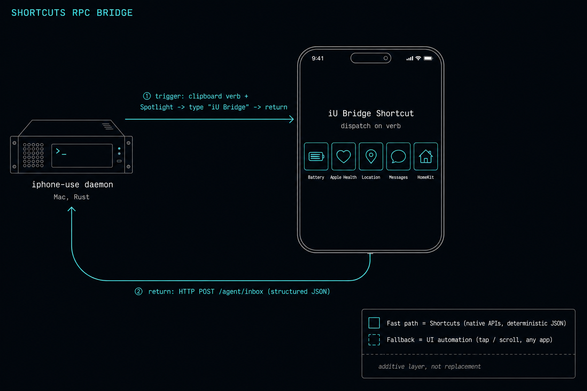

<p align="center">
  
</p>

<h1 align="center">iphone-use</h1>

<p align="center"><em>Computer-use, but for the iPhone — let AI agents (and your browser) see and drive a real phone.</em></p>

<p align="center">
  <a href="LICENSE"></a>
  
  
  
</p>

<p align="center">
  <strong>English</strong> ·
  <a href="README.zh-CN.md">简体中文</a>
</p>

<p align="center">
  
</p>

**See and control a real iPhone from a browser or an AI agent.** The default
`direct` backend runs WebDriverAgent (WDA) on the phone: the daemon proxies its live
MJPEG screen at `/agent/mjpeg`, while browser commands go through the acknowledged
`POST /control` endpoint and agent commands use `/agent/input`.

The direct path does **not** use macOS iPhone Mirroring, Screen Recording, Accessibility,
the Mac cursor, or a frontmost window. The original ScreenCaptureKit + CGEvent path remains
available only as the explicit `PHONE_REMOTE_BACKEND=mirror` compatibility backend.

## Features

- 📱 **Direct live view** — the browser renders WDA's on-device MJPEG stream through `/agent/mjpeg`, with PNG stills as a degraded fallback.
- 🤚 **Phone-side control** — tap, drag, long-press, scroll, and text are synthesized by WDA on the iPhone; no Mac cursor or focus stealing.
- ✅ **Acknowledged browser input** — `/control` reports success or failure instead of silently accepting commands over a disconnected data channel.
- 🤖 **Agent-ready** — an HTTP API (`/agent/input`, `/agent/screenshot`) lets AI agents and scripts *see* and *drive* the phone.
- 🌐 **Browser access** — use the phone UI on a trusted, isolated LAN, or put the daemon behind an authenticated HTTPS tunnel you operate.
- 🔒 **Self-hosted & authenticated** — password login; runs on your own machine, your screen never leaves your control.

> Migration status: individual WDA element, text, tap, and screenshot capabilities have
> been exercised on real hardware. The new direct-by-default browser vertical still needs
> the end-to-end hardware acceptance run listed below; source and automated-test success
> must not be read as that proof.

## Architecture

```text
Browser <── GET /agent/mjpeg ── iphone-use daemon ── 127.0.0.1:9100 ──┐
Browser ── POST /control ─────> iphone-use daemon ── 127.0.0.1:8100 ──┤ WDA on iPhone
Agent   ── /agent/* ──────────> iphone-use daemon ── 127.0.0.1:8100 ──┘
```

The full lifecycle, failure-state, security, and hardware-acceptance design is in
**[`docs/direct-device-architecture.html`](docs/direct-device-architecture.html)**.

`scripts/setup-wda.sh` builds and signs WDA, starts the XCUITest runner, and creates
localhost relays for WDA control (`8100`) and video (`9100`). Keeping the daemon on
localhost endpoints avoids giving a background process direct access to a changing phone
IP. The normal setup path requires USB and uses `iproxy`; it does not automatically
switch to Wi-Fi or `socat`. A `socat` path is manual/experimental operator configuration.

The default backend is fail-closed: if WDA is unavailable, direct control returns an
error and does not fall back to moving the Mac cursor.

### Legacy mirror compatibility

Set `PHONE_REMOTE_BACKEND=mirror` only when you intentionally need the old path. It
captures the iPhone Mirroring window with ScreenCaptureKit, encodes H.264 with
VideoToolbox, streams over WebRTC, and injects input with CGEvent. That mode alone needs:

- iPhone Mirroring configured and connected;
- Screen Recording and Accessibility grants for iPhoneUse;
- an active Aqua login session and a frontmost-capable Mirroring window.

The architecture/deployment/control images in `assets/` describe this legacy backend,
not the direct default.

## Requirements

- macOS 15 or later.
- **Full Xcode.app**, not only Command Line Tools. In Xcode → Settings → Accounts,
  sign in and select an Apple development team; a free Personal Team works but its
  WDA provisioning profile normally needs periodic renewal.
- An iPhone with **Developer Mode** enabled.
- The iPhone paired with and trusted by the Mac. Use USB for first setup and for the
  most reliable relay; when prompted on the phone, tap **Trust**.
- Keep the iPhone **unlocked and awake** while WDA is built, launched, and controlled.
  WDA cannot bypass Face ID/passcode or act on a locked screen.
- `iproxy` (`brew install libimobiledevice`) for the normal USB relay path.
- A Rust toolchain (`cargo`) only when building from source.

Direct mode does not require iPhone Mirroring, Screen Recording, or Accessibility.

## Install

Install the latest GitHub Release and register the per-user LaunchAgent:

```bash
curl -fsSL https://raw.githubusercontent.com/leeguooooo/iphone-use/main/install.sh | sh
```

The installer defaults to `PHONE_REMOTE_BACKEND=direct`, installs the daemon, writes its
localhost WDA/MJPEG endpoints, and places the current setup helper at
`~/.iphone-use/setup-wda.sh`. It does **not** prove that your development team, phone,
runner, relays, and browser work together. Complete first-device setup with the phone
connected, trusted, unlocked, and awake:

```bash
~/.iphone-use/setup-wda.sh doctor
~/.iphone-use/setup-wda.sh
~/.iphone-use/setup-wda.sh status
```

Pause managed WDA when you want uninterrupted hands-on use of the phone, then
resume it before the next agent session:

```bash
~/.iphone-use/setup-wda.sh pause
~/.iphone-use/setup-wda.sh resume
```

`pause` disables the dedicated launchd job and stops only processes whose saved
PID and command identity still match. `resume` validates that job before loading it
again. After a lock-screen failure, rebuild attempts back off from 30 seconds to at
most 15 minutes instead of repeatedly asking for the passcode. Other failures back
off from 5 seconds to at most 5 minutes. A verified recovery resets either schedule.
An interactive setup waits at most 5 minutes for unlock and backs off its reminders;
press `Ctrl-C` to stop sooner and rerun after unlocking.

Then open **`http://<mac-lan-ip>:44321/setup`** for the built-in live connection guide.
It translates `/agent/status` into the current USB, trust, developer-service, WDA, or
external-host blocker without changing VPN/proxy settings or running setup for you. Once
the device is drivable, continue to **`/phone`**. Enter the password printed by
`install.sh` when prompted. If more than one iPhone is paired, pin the same classic
device UDID in both places:

```bash
export PHONE_REMOTE_UDID=00008…
curl -fsSL https://raw.githubusercontent.com/leeguooooo/iphone-use/main/install.sh | sh
WDA_UDID="$PHONE_REMOTE_UDID" ~/.iphone-use/setup-wda.sh
```

For a local source build:

```bash
cargo build --release --bin iphone-use --bin iphone-use-mcp
./scripts/make-app.sh                 # → ./iPhoneUse.app
./install.sh ./iPhoneUse.app           # signs, installs, writes the LaunchAgent
```

**Pre-built binaries** are published from CI on every version tag — see the
[Releases page](https://github.com/leeguooooo/iphone-use/releases). The installed app
contains a release-matched MCP bridge at
`~/Applications/iPhoneUse.app/Contents/MacOS/iphone-use-mcp`; the same universal binary
is also published as a checksum-protected standalone archive. Signing follows the selected
backend:

- **Direct:** preserve any valid existing app signature. If the staged app is unsigned or
  invalid, repair it with keychain-free ad-hoc signing. Direct does not need a stable TCC
  identity because it does not request Screen Recording or Accessibility.
- **Mirror:** use the stable local `iPhoneUse Local Signing` identity so mirror-only TCC
  grants can survive upgrades. If that signer is unavailable, the installer warns before
  falling back to ad-hoc signing.

### Run without installing (dev)

```bash
PHONE_REMOTE_BACKEND=direct \
PHONE_REMOTE_WDA_URL=http://127.0.0.1:8100 \
PHONE_REMOTE_WDA_MJPEG_URL=http://127.0.0.1:9100 \
PHONE_REMOTE_HOST=0.0.0.0 PHONE_REMOTE_PASSWORD=secret \
  ./target/release/iphone-use serve
```

### Upgrades

The daemon checks GitHub releases daily and reports it in `GET /agent/status`
(`version` / `latest` / `update_available`); the web client shows a banner when
you're behind. Upgrading is the same one-liner as installing:

```bash
curl -fsSL https://raw.githubusercontent.com/leeguooooo/iphone-use/main/install.sh | sh
```

The installer resolves the release tag to one exact commit for helpers and the skill;
the daemon app comes from the corresponding Release asset and is checked against its
published SHA-256. It installs and byte-verifies the companion skill at
`~/.agents/skills/iphone-use`, plus its Claude Code discovery link, before replacing
the daemon. A skill fetch, validation, or install failure aborts the upgrade; if a
later daemon step fails, the previous skill, discovery target, and skills lock are
restored. No separate skills CLI command is needed.

To deliberately leave the skill untouched:

```bash
curl -fsSL https://raw.githubusercontent.com/leeguooooo/iphone-use/main/install.sh \
  | IPHONE_USE_SKIP_SKILL=1 sh
```

That opt-out is a degraded install: the installer makes no compatibility claim between
the new daemon and an existing skill.

Upgrade migration is evidence-based: an older plist with no backend key but a valid
loopback `PHONE_REMOTE_WDA_URL` moves to Direct. Only a legacy install with no WDA
configuration stays on Mirror compatibility. An explicit backend remains explicit.

Disable the check with `PHONE_REMOTE_NO_UPDATE_CHECK=1` (air-gapped setups).

### Feedback — humans and agents alike

Rough edge? [Open an issue](https://github.com/leeguooooo/iphone-use/issues).
**AI agents are explicitly invited**: the bundled skill instructs agents to
file structured issues (with user consent) when they hit friction using the
API — misleading errors, missing capabilities, docs that lie. Complaints from
the heaviest users make the product better.

## Configuration (environment)

| Variable | Default | Purpose |
|---|---|---|
| `PHONE_REMOTE_BACKEND` | `direct` | `direct` = WDA input + on-device MJPEG, with no iPhone Mirroring or Mac TCC grants. `mirror` = explicit legacy ScreenCaptureKit + CGEvent compatibility path. |
| `PHONE_REMOTE_HOST` | `127.0.0.1` | Listen address (`0.0.0.0` for LAN). |
| `PHONE_REMOTE_PORT` | `44321` | Listen port. |
| `PHONE_REMOTE_PASSWORD` | *(none)* | Shared password (cookie login + agent bearer fallback). |
| `PHONE_REMOTE_AGENT_TOKEN` | *(none)* | Dedicated agent bearer token. When set, the agent API accepts **only** this token (the password is no longer valid as a bearer); unset = password doubles as the bearer (legacy). |
| `PHONE_REMOTE_UDID` | installer detects and persists; otherwise unset | Canonical classic iPhone UDID used for managed WDA and destructive device commands. A request cannot temporarily switch a configured target; change the deployment value and restart instead. Pass the same value as `WDA_UDID` during setup. |
| `PHONE_REMOTE_WDA_URL` | `http://127.0.0.1:8100` in direct installs | WDA control loopback. WDA itself has no authentication; direct input fails closed when this endpoint is unavailable. |
| `PHONE_REMOTE_WDA_MJPEG_URL` | `http://127.0.0.1:9100` in direct installs | WDA MJPEG loopback. WDA itself has no authentication; the daemon exposes it to authenticated viewers at `/agent/mjpeg`. |
| `PHONE_REMOTE_WDA_MANAGED` | on for Direct loopback endpoints | Whether this daemon owns the local WDA supervisor/relay lifecycle. Remote endpoints must be externally managed. |
| `WDA_RUNNER_ICON` | `auto` | Home-screen icon for the managed WDA runner: `auto` reuses the installed iPhoneUse app icon, `none` keeps WDA's placeholder, and an absolute `.png`/`.icns` path supplies a custom icon. Icon failures only warn; WDA setup continues. |
| `PHONE_REMOTE_WDA_SNAPSHOT_MAX_DEPTH` | *(unset — WDA default 50)* | Opt-in bound on WDA's accessibility snapshot depth (`snapshotMaxDepth`), applied once per WDA session. Try `20`–`30` if an app with an enormous tree (e.g. KakaoTalk, issue #44) kills the runner during `/agent/elements`. |
| `PHONE_REMOTE_WDA_SNAPSHOT_TIMEOUT_S` | *(unset — WDA default 15)* | Opt-in bound on WDA's snapshot resolution time in seconds (`customSnapshotTimeout`), so an oversized snapshot fails that one request instead of wedging until testmanagerd kills the runner. |
| `PHONE_REMOTE_ELEMENTS_AFFORDANCES` | *(unset — off)* | Set `1` to enrich `/agent/elements` rows with sparse action affordances derived from the accessibility traits WDA already sends: `actions` (e.g. `["increment","decrement","adjust"]` on sliders/steppers/picker wheels, `["toggle"]` on switches), `selected` (tab bars/segmented controls), and `min`/`max` (slider/stepper range). Off = byte-identical JSON. |
| `PHONE_REMOTE_ELEMENTS_TRAITS` | *(unset — off)* | Set `1` to also emit each row's verbatim accessibility `traits` names (debugging/forward-compat; most duplicate `kind`). |
| `PHONE_REMOTE_IDLE_RELEASE_SECS` | `300` | After this many seconds without agent activity or a live viewer, stop the WDA runner so the phone is free for hands-on use. Reconnect starts it again; unlock the phone if required. Set `0` to keep WDA running. |
| `PHONE_REMOTE_CF_TURN_KEY_ID` / `_API_TOKEN` | — | Legacy mirror/WebRTC Cloudflare TURN credentials. Not used by the direct MJPEG path. |
| `PHONE_REMOTE_TURN_URLS` / `_USERNAME` / `_CREDENTIAL` | — | Legacy mirror/WebRTC static TURN credentials. |
| `PHONE_REMOTE_AUTO_RESUME` | *(off)* | Legacy mirror-only experiment for clicking the Mirroring Resume/Connect interstitial. |

## Agent API

Agents drive the phone by connecting to the running daemon. Bearer auth:
`Authorization: Bearer <token>` where token is `PHONE_REMOTE_AGENT_TOKEN` when set,
otherwise `PHONE_REMOTE_PASSWORD` (legacy fallback).

Every state-changing POST also requires the exact header `X-Phone-Control: 1`.
This is a CSRF/intent guard in addition to bearer or session authentication, not a
replacement for it. It applies to `/control`, `/agent/input`, `/agent/mode`, and the
POST forms of `/agent/inbox` and `/agent/inbox/drain`; GET requests do not need it.
The bundled web and MCP clients add the header automatically.

**Phone owner lease (#72).** Send `X-Phone-Owner: <session-name>` (1–64 printable ASCII) on control requests to claim the phone for this session. While that lease is live (refreshed by each of your control requests; `PHONE_REMOTE_OWNER_LEASE_SECS`, default 300), control requests from any other session — or from a client that sends no owner — are refused with `409 phone_owned` naming the owner and the seconds left; read-only calls still work. The owner releases early with `POST /agent/owner {"release":true}`; the daemon clears the lease when it idle-releases the phone. `X-Phone-Owner-Takeover: 1` replaces a live lease and is logged — use it only for an abandoned session. The bundled MCP server sends `PHONE_REMOTE_OWNER` (else `mcp-<pid>`) automatically.


| Method | Path | Purpose |
|---|---|---|
| `GET` | `/agent/status` | Health and readiness: check `backend`, `target_configured`, `managed_wda`, `managed_wda_pending`, `recovery_owner`, WDA readiness, lifecycle fields, viewer counts, `hint`, `setup_blocked_on`, `setup_phase`, and `setup_message`. | Includes `instance`, `udid`, and — when a session has claimed the phone — `owner` / `owner_lease_remaining_secs` (#72).
| `GET` | `/agent/mjpeg` | Authenticated live on-device screen stream for browsers. |
| `POST` | `/control` | Cookie-authenticated browser input. Requires the mutation header and a bounded `ttl_ms`; the only success body is `{"ok":true}`. |
| `POST` | `/agent/mode` | Requires the mutation header and recovers only the configured backend: Direct accepts `{"mode":"agent"}`, Mirror accepts `{"mode":"mirror"}`. It never changes backend or the canonical UDID. |
| `POST` | `/agent/hold` | Requires bearer auth and the mutation header. `{"secs":N}` keeps the phone from idle-release for N seconds (0 clears, max 14400); status echoes `hold_remaining_secs`. Use around a hands-on step so a human pause never triggers a 60–120s WDA rebuild. Answers `503 device_release_in_progress` (+`Retry-After`) if the idle watchdog is already stopping WDA — a hold is never accepted and then lost. |
| `POST` | `/agent/owner` | Requires bearer auth and the mutation header. `{"release":true}` hands the phone lease back (only the current `X-Phone-Owner` may release a live lease). Status reports `owner` and `owner_lease_remaining_secs`. |
| `POST` | `/agent/input` | Requires bearer auth and the mutation header. Sends tap / drag / long-press / scroll / text / `set_value` / `perform` / `alert` and currently supported WDA commands. `?return=delta` also returns the settled post-action element change (and any system `alert`) in the same response. |
| `POST` | `/agent/actions` | Direct/WDA-only bounded multi-step execution. The whole batch is validated before dispatch; `wait_for` provides semantic checkpoints and the first failure prevents every later action. |
| `GET` / `POST` | `/agent/inbox` | GET safely peeks at the legacy Shortcuts result queue. POST requires bearer auth plus the mutation header and appends one result. |
| `POST` | `/agent/inbox/drain` | Requires bearer auth plus the mutation header; atomically returns and clears the queued results. |
| `GET` | `/agent/intents` | The curated semantic-intent registry (`~/.iphone-use/intents-registry.json`), served per request. A missing file returns an empty list with a setup hint, never an error; malformed entries are skipped fail-closed. |
| `POST` | `/agent/intent` | Requires bearer auth and the mutation header. Dispatches one registered verb (`{"name":"battery","args":{}}`) by opening a `shortcuts://run-shortcut` deep link on-device through WDA's session-scoped `POST /session/:sid/url`; the bridge shortcut's result arrives on `/agent/inbox`, matched by the returned `id`. First use of each verb needs one interactive permission blessing on the phone, and the Shortcuts app foregrounds during a call. Errors carry the honest `outcome`/`retry_safe` taxonomy; a devicectl fallback is only ever a hint, never auto-dispatched. |
| `GET` | `/agent/screenshot` | Current phone screen as PNG from the on-device path. |
| `GET` | `/agent/elements` | Flattened WDA accessibility tree plus an ephemeral `snapshot` token. `?since=<snapshot>` answers with a `delta` (`added`/`changed`/`removed`/`unchanged`) against a still-cached prior tree instead of the full list; an unknown baseline falls back to the full tree. Both shapes include a read-only `ax_stats` block (`n`, `n_interactive`, `labeled_frac`, `coverage`, `container_only`, `max_depth`) so clients can judge tree usability before falling back to vision. It also carries a sparse `alert:{text,buttons}` block while a system alert (UIAlertController) is on screen. Missing/busy WDA returns `503`; a failed source retry returns `502`, never a misleading `200` empty tree. |

Gate actions on **`drivable`** and, for direct mode, require
`backend:"direct"` plus `wda_actionable:true`. `phone_target`, `mirror_state`, and
`human_active` describe the legacy mirror backend and must not be used as proof that the
direct device is controllable. Direct mode never falls back to Mac-side input.
`device_state` may be `ready`, `locked`, `blocked`, `offline`, `releasing`, `released`,
or `reconnecting`. `recovery_owner` is `daemon` for managed loopback WDA,
`unconfigured` while first-run local management is waiting for a persistent target,
and `external` for a remote or explicitly unmanaged endpoint. `viewer_count` includes
both `/ws` and MJPEG viewers;
`mjpeg_viewer_count` reports the MJPEG subset.

Direct input is at-most-once. `/control` uses its required 1–2500 ms `ttl_ms`;
`/agent/input` uses a server-side 15-second total deadline. Expiry before dispatch returns
`408` with `error:"not_sent"` and `retry_safe:true`. If execution already started but the
WDA/transport fails without proving the action did not land, the daemon returns `502`;
a post-dispatch deadline returns `504`. Both use `error:"outcome_unknown"` and
`retry_safe:false`. On 502/504, inspect status and the current screen/elements; never
blindly replay text, scroll, Back, taps, or another non-idempotent action.
An element index is only valid with the `snapshot` returned by the same
`/agent/elements` response. If the tree changes, the tap fails closed with
`409 stale_element_snapshot`; fetch a new tree and choose again. Persist labels or
other stable locators in scripts, never snapshot tokens or element indexes.
Exact-label taps also fail closed before acting when there are zero or multiple
matches; repeated labels must be disambiguated from the element tree.
`set_value` (`{"type":"set_value","element":N,"snapshot":"…","value":"…"}`) writes a
field's contents directly through WDA (clear-then-type; empty string clears), and
`scroll` with `element`+`snapshot` keeps both gesture endpoints inside that element's
rectangle so a list scrolls without straying into a neighboring scroll view. Both are
snapshot-bound and fail closed exactly like indexed taps.
`perform` (`{"type":"perform","element":N,"snapshot":"…","action":"…"}`) invokes a
named affordance on a snapshot-bound element through WDA's element-scoped routes:
`increment`/`decrement` (picker wheels, steppers, sliders), `adjust` (set a picker
wheel's value, or a slider's normalized 0–1 position, via `"value"`), `toggle`
(switches), `menu` (long-press context menu, optional `duration_ms`), `double_tap`,
`two_finger_tap`, `scroll_to_visible`, `pinch` (`scale`, optional `velocity`),
`rotate` (`rotation` radians, optional `velocity`), and `force_press` (optional
`pressure`+`duration_ms`). An unknown action name returns
`422 unsupported_perform_action` without dispatching; an element that cannot carry
the action returns `invalid_element_target`. With
`PHONE_REMOTE_ELEMENTS_AFFORDANCES=1`, `/agent/elements` rows advertise their
non-default actions (plus `selected` and `min`/`max`) so an agent can discover them
without vision.
`POST /agent/input?return=delta` (optionally `&since=<snapshot>&settle_ms=<ms>`)
settles after an applied action and returns `snapshot` plus a `delta` against the
baseline (or full `elements` when no baseline is cached) in the same response —
halving the act-then-verify round trips. A failed post-action read reports
`delta_error` alongside `ok:true`; the action still applied.
`/agent/actions` accepts at most 24 `action`, `wait_for`, or bounded `pause` steps,
holds one WDA control lock, and stops at the first failure. Its response includes
`completed`, `applied_actions`, `failed_step`, `outcome`, and `retry_safe` where
applicable. If earlier actions were applied, replaying the entire batch is never
reported safe. `tap_locator` uses the same exact
label/identifier/kind/value/focused/enabled/visible fields as `wait_for` and requires
one unique current match, closing the gap between durable checks and durable actions.

Full reference: **[`docs/agent-api.html`](docs/agent-api.html)**.
The competitive research and proposed low-token replay contract are in
**[`docs/scripted-flows-research.html`](docs/scripted-flows-research.html)**.

```bash
HOST=http://<mac-lan-ip>:44321; AUTH="Authorization: Bearer $PW"
MUTATION="X-Phone-Control: 1"
curl -s -H "$AUTH" "$HOST/agent/screenshot" -o screen.png
curl -s -H "$AUTH" -H "$MUTATION" -X POST "$HOST/agent/input" -d '{"type":"tap","x":0.5,"y":0.3}'
curl -s -H "$AUTH" -H "$MUTATION" -X POST "$HOST/agent/input" -d '{"type":"text","text":"你好"}'
curl -s -H "$AUTH" -H "$MUTATION" -X POST "$HOST/agent/actions" -d '{"steps":[{"kind":"action","action":{"type":"shortcut","name":"home"}},{"kind":"wait_for","expect":{"present":[{"label":"搜索"}]},"timeout_ms":3000}]}'
```

## MCP server

[`iphone-use-mcp`](crates/mcp/README.md) is an MCP stdio server (`crates/mcp`) that
bridges MCP clients — Claude Desktop, Claude Code — to the daemon's agent API. Twelve
tools: `phone_status`, `screenshot`, `elements`, `tap`, `tap_element`, `tap_label`,
`scroll`, `type` (CJK-clean when WDA is live), `key`, `shortcut`, `phone_run_steps`, and
`phone_reconnect`. `tap_element` requires the index and snapshot from the same
`phone_elements` response; `tap_label` requires one exact unique match.
`phone_reconnect` has no parameters: it recovers only the persisted canonical managed
Direct/WDA target, never accepts a UDID, changes device, or falls back to Mirroring.
`phone_run_steps` combines stable actions and semantic waits in one MCP call; the
daemon validates the full sequence and fails closed. The MCP client automatically adds
`X-Phone-Control: 1` to its state-changing daemon requests. There is no generic MCP mode
switch. `launch_app` by validated bundle id and picker selection are available inside
`phone_run_steps`; long-press, swipe, and drag are also available as sequence steps.
Keyboard dismissal and uninstall are not individual MCP tools.
Two env vars: `PHONE_REMOTE_URL` (default `http://127.0.0.1:44321`) and
`PHONE_REMOTE_TOKEN` (optional; maps to `PHONE_REMOTE_AGENT_TOKEN` on the daemon side).

Add to your `claude_desktop_config.json` (or Claude Code MCP config):

```json
{
  "mcpServers": {
    "iphone-use": {
      "command": "/Users/YOUR_ACCOUNT/Applications/iPhoneUse.app/Contents/MacOS/iphone-use-mcp",
      "env": {
        "PHONE_REMOTE_URL": "http://127.0.0.1:44321",
        "PHONE_REMOTE_TOKEN": "<your-agent-token>"
      }
    }
  }
}
```

The normal installer supplies that executable together with the matching daemon and
agent skill; replace `YOUR_ACCOUNT` with the macOS account name. See
[`crates/mcp/README.md`](crates/mcp/README.md) for full tool schemas and standalone
installation.

The same binary can replay a reviewed flow with no model in the happy path:

```bash
MCP="$HOME/Applications/iPhoneUse.app/Contents/MacOS/iphone-use-mcp"
"$MCP" flow validate examples/flows/open-spotlight.json
PHONE_REMOTE_TOKEN="$PHONE_REMOTE_AGENT_TOKEN" \
  "$MCP" flow run examples/flows/open-spotlight.json
PHONE_REMOTE_TOKEN="$PHONE_REMOTE_AGENT_TOKEN" \
  "$MCP" flow run examples/flows/search-spotlight.json --input 'query=coffee'
```

The **official flow registry** ([`leeguooooo/iphone-use-flows`](https://github.com/leeguooooo/iphone-use-flows))
turns this into a chrome-use-style installable source: reviewed per-app flows,
grouped by app and category, fetched with checksums and validated before they
touch disk, then run by id with no model in the loop:

```bash
"$MCP" flow update                        # mirror the registry into ~/.iphone-use/flows
"$MCP" flow list --category health        # id · risk · verified · inputs · name
"$MCP" flow info health/export-all        # metadata and step templates
PHONE_REMOTE_TOKEN="$PHONE_REMOTE_AGENT_TOKEN" \
  "$MCP" flow run system/spotlight-search --input query=Health
"$MCP" flow add my-flow.json --as myapp/daily-check   # your own, survives update
```

Registry metadata is optional on every flow: `app` (bundle id), `category`,
`risk` (`read_only` | `navigation` | `side_effect` — the last refuses to run
without `--confirm`), `locale`, `tags`, and `verified_on` (hardware runs that
proved the file). Only the official source is supported; files are pure JSON, so
installing the registry never executes code. MCP clients get the same surface as
`phone_flow_list`, `phone_flow_info`, `phone_flow_run`, and `phone_flow_update`, plus
`phone_flow_publish` (open a PR with a working flow) and `phone_flow_report` (file an issue
for a broken one); `phone_elements` tells the agent which installed flows fit the app on
screen, so checking the registry is the path of least resistance.

Saved flow v1 is strict JSON containing `version`, `name`, optional `description`,
optional string `inputs`, and the same guarded `steps` used by `phone_run_steps`.
`--input KEY=VALUE` resolves values only for the current run and never writes them back
to JSON. It never retries failed or unknown results. CLI values may remain visible in
shell history or process inspection, so do not use them for credentials, private
content, payment, send, publish, or delete actions.

The browser control bar now includes **流程** recording. It records only
acknowledged actions, prefers exact accessibility labels selected through **Controls**,
and deterministically compares bounded post-action element trees. When a new unique
accessibility identifier or foreground application is provable, it appends a reviewable
`wait_for` checkpoint; otherwise the 350 ms fallback remains visible. Automatic
checkpoints never persist arbitrary screen labels or values, which may contain private
content. Coordinate gestures are marked as fragile. Typed text becomes a named runtime
input while the literal recorded value is discarded; the browser asks for an in-memory
value before execution and never includes it in downloaded JSON. Actions move with their
checkpoints in the review surface. A reviewed flow can be downloaded as valid v1 JSON or
sent once to `/agent/actions`. A later browser session can use **打开脚本** to load the
saved JSON, fill fresh runtime parameters, review it, and run it without involving a
model. Browser import enforces the same 64 KiB, 24-step, field, geometry, wait, input,
and total-wait boundaries before showing the flow; its privacy-safe subset rejects
literal typed text and requires named runtime inputs. If another action could not be
persisted, the UI labels
the download as an incomplete draft and disables one-shot execution. Otherwise direct
execution remains disabled until every required input is filled and the operator
confirms the flow contains no payment, send, publish, delete, or other irreversible
action.

## Shortcuts bridge (legacy mirror experiment)



The existing **"iU Bridge"** implementation opens Spotlight and feeds clipboard/key
events through the Mac-side Mirroring input path. It therefore belongs to
`PHONE_REMOTE_BACKEND=mirror` and is **not currently part of the direct/WDA product
path**. This does not apply to the browser's Home and Spotlight buttons: both now have
explicit on-device WDA routes, as do the supported named WebDriver keys. App Switcher,
Control Center, the Shortcuts bridge, and arbitrary synthetic Mac keycodes remain
unsupported in Direct until they have a device-native implementation and hardware
acceptance.

Legacy details remain in [`shortcuts/README.md`](shortcuts/README.md) and
[`shortcuts/registry.json`](shortcuts/registry.json).

The Direct-native successor is the **semantic intents channel**
(`GET /agent/intents` + `POST /agent/intent`): the daemon opens the
`shortcuts://run-shortcut` deep link on-device through WDA — no Spotlight, no
clipboard carrier — and the bridge shortcut still answers via `/agent/inbox`.
Curate verbs in `~/.iphone-use/intents-registry.json` (start from
[`deploy/intents-registry.example.json`](deploy/intents-registry.example.json)),
and generate the matching bridge shortcut instead of building it by hand:

```bash
python3 deploy/make-bridge-shortcut.py --token "$PHONE_REMOTE_AGENT_TOKEN"
open "iU Bridge.shortcut"     # accept the import dialog; iCloud syncs it to the phone
```

The shortcut's name must equal the registry's `bridge.name`, and the bearer
token is stored inside the shortcut's own request headers — it never travels in
the deep link. `--self-test` checks the parts of a Shortcuts plist that fail
silently (variable slots, response JSON, branch balance) without writing files.
First run of each verb needs one interactive permission blessing on the phone,
and Shortcuts foregrounds during a call.

**The return path needs the phone to reach the daemon** (issue #59). Dispatch
travels Mac → phone over the WDA relay, but the bridge shortcut answers with a
`POST /agent/inbox` *from the phone*, so a loopback-only daemon — the hardened
`PHONE_REMOTE_HOST=127.0.0.1` default — can dispatch a verb and never receive
its result. **The default stays loopback, which means the intents channel is
off until you configure one of these:**

| Return path | How | Trade-off |
|---|---|---|
| LAN bind | `PHONE_REMOTE_HOST=0.0.0.0` (keep the password *and* `PHONE_REMOTE_AGENT_TOKEN` set) | Simplest. Exposes the daemon's authenticated surface to everything on your LAN — a security-posture decision, not a default. |
| USB reverse tunnel | Forward a phone-side port back to the Mac's loopback listener | No LAN exposure; more moving parts to keep alive. |

Dispatch-only verbs (fire-and-forget, nothing read back) work on plain loopback.
Do not set `0.0.0.0` on an untrusted network: WDA's own `8100`/`9100` listeners
have no authentication of their own.

## Agent skill

Teach any skills-capable agent (Claude Code, etc.) to drive your phone — including
the **vision once → script forever** methodology (solve a phone task visually the
first time, then freeze it into a repeatable one-command script). The normal
`install.sh` flow installs the exact skill from the daemon release commit into the
canonical global location, verifies both the installed bytes and Claude Code discovery,
and updates both as one transaction. Rerun that installer to upgrade; do not update
this skill independently from a moving source. A local
`./install.sh /path/to/iPhoneUse.app` development install uses the worktree copy instead.

The skill covers the agent API and see→act→verify loop. Treat older examples that rely
on the Shortcuts bridge, App Switcher, Control Center, or arbitrary Mac keycodes as
legacy. Home, Spotlight, and the documented named keys use Direct/WDA. See
[`skills/iphone-use/SKILL.md`](skills/iphone-use/SKILL.md).

## Security notes

This tool exposes live phone control over the network. Treat the URL and password like
sensitive credentials.

- The daemon password/cookie/bearer protects port `44321`; it does **not** authenticate
  WDA's device-side `8100` control or `9100` MJPEG services.
- USB `iproxy` pins the Mac loopback relay to a UDID. It does not add authentication to
  WDA or prevent another host on the iPhone's LAN from connecting directly to the phone's
  WDA ports.
- Phase 1 is for trusted, isolated networks. Do not run WDA on guest Wi-Fi, public
  networks, or an uncontrolled office LAN; disabling iPhone Wi-Fi while using USB reduces
  exposure.
- A real authenticated device-transport boundary requires the Phase 2 companion app or
  a controlled authenticated tunnel. Do not mistake daemon login for WDA protection.
- A password is mandatory when binding to the LAN (`install.sh` enforces it).
- For remote daemon access, put port `44321` behind an authenticated HTTPS tunnel you
  operate. The daemon itself serves plain HTTP and reads `X-Forwarded-Proto`; its session
  cookie is `HttpOnly` + `SameSite=Lax`.
- Don't leave payment apps, private chats, or 2FA screens open while exposing access.
- Stop / unload the LaunchAgent when not in use.

### WARP / VPN

WARP and other VPNs can break the CoreDevice tunnel used to install, launch, or recover
WDA. `setup-wda.sh doctor` detects and explains the blocker; it does **not**
automatically disconnect or restore WARP/VPN. The operator owns that network-policy
decision. While daemon-owned recovery is affected, `/agent/status` reports
`device_state:"blocked"`, `setup_blocked_on:"warp"`, and an actionable hint instead of
the generic reconnect wait text. Managed Macs should use an administrator-approved
split-tunnel rule.

**WARP also breaks iPhone Mirroring itself, with none of this running.** Mirroring
rides on Continuity, so an always-on VPN that degrades Wi-Fi association and the
CoreDevice tunnel can leave the Mirroring window stuck at *Connecting* or timing out
even with the daemon stopped and no WDA installed (issue #17, reproduced independently
on macOS 26 and 27.0 beta). Confirm before filing a bug here:

1. Stop everything of ours — `launchctl bootout gui/$(id -u)/com.leeguoo.iphone-use`
   and the `.wda` job — and quit the Mirroring window.
2. `warp-cli disconnect` (or fully quit the VPN client).
3. Reopen iPhone Mirroring.

If it connects at step 3, the daemon was never involved and the fix is the same
split-tunnel exclusion as above. A Zero Trust *Always On* policy will reconnect WARP
on its own, so a lasting fix needs an administrator exclusion rather than a manual
disconnect.

## Roadmap

The product direction is direct-to-device. Current priorities:

- [ ] Complete and record the direct-browser hardware acceptance matrix below.
- [ ] Make WDA first-device setup, signing renewal, sleep/reconnect recovery, and
  multi-device selection understandable from the product UI.
- [ ] Revalidate each advertised command against the direct backend; do not inherit
  legacy Mirroring capability claims by name.
- [x] **MCP server** wrapping the agent API, so MCP clients (Claude, etc.) get
  `tap` / `type` / `scroll` / `screenshot` as native tools.
- [ ] **Cross-network validation** of the Cloudflare dynamic TURN path with a real key
  for the legacy mirror backend. The direct path instead needs an authenticated HTTPS
  streaming/control validation outside the LAN.
- [x] **Element-tree control via WebDriverAgent (the "L2" layer)** — shipped and
  component-validated on an iPhone 17 / iOS 27 through the daemon API: Unicode text,
  label taps, elements, coordinates, and on-device screenshots. Setup and known device
  constraints are in
  **[`docs/wda-setup.html`](docs/wda-setup.html)**.
- [x] **Release binaries** in CI + a one-line `curl … install.sh | sh` install.
- [ ] **Phase 2 authenticated device transport** through a companion app or controlled
  tunnel; only then treat device-side video/control as authenticated.
- [ ] A short **demo** (GIF / video) of an AI agent driving the phone through the API.

Issues and PRs welcome.

## Hardware acceptance boundary

The new default is accepted only after all of these are observed on a real iPhone; a
build, unit-test pass, daemon health response, or previously validated WDA component is
not a substitute:

1. Start from a Mac without Screen Recording or Accessibility grants and without opening
   iPhone Mirroring; install the daemon, run WDA setup, and confirm direct mode stays up.
2. Confirm `/agent/status` reports `backend:"direct"`, `wda:true`,
   `wda_actionable:true`, and `drivable:true` for the intended `PHONE_REMOTE_UDID`.
3. Open `/phone` from another browser/device and observe a continuously updating
   `/agent/mjpeg` picture; deliberately stop the 9100 relay and verify the UI reports
   degraded/offline video rather than pretending success.
4. Exercise tap, drag, long-press, scroll, ASCII and CJK text through browser `/control`;
   verify every command is acknowledged and lands once on the phone.
5. Exercise `/agent/elements`, `/agent/screenshot`, and `/agent/input` through bearer
   auth, including a failed WDA endpoint; verify no command moves the Mac cursor.
6. Observe `releasing` → `released` → `reconnecting` → `ready`; also exercise
   lock/unlock, USB reconnect, Mac restart, and WDA renew/reinstall. Confirm the target
   never silently changes on a multi-device Mac.
7. On an isolated test network, inspect whether the iPhone IP exposes unauthenticated
   `8100/9100`; record the result instead of treating the Mac loopback relay as a firewall.

Until that matrix is recorded, this README describes the intended default and the
implemented interfaces, not a claim that `install.sh` has completed a full hardware run.

## Layout

- `crates/server` — direct WDA control/MJPEG proxy, browser control, agent API, plus the
  legacy mirror signaling path.
- `crates/core` — ScreenCaptureKit, encoding, geometry, input injection, and lease code
  retained for the legacy mirror backend.
- `web/index.html` — the browser client (direct MJPEG/control by default; legacy WebRTC
  compatibility when explicitly selected).
- `install.sh`, `scripts/make-app.sh`, `deploy/` — packaging + LaunchAgent.
- `docs/` — design spec, runbooks, agent API reference, research notes.

## License

[MIT](LICENSE)
